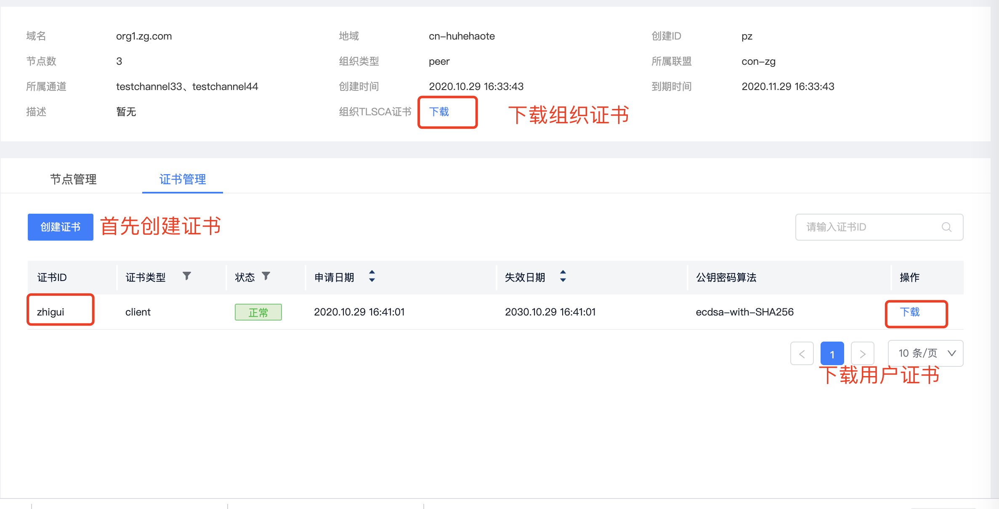

# Hyperledger Fabric Connector

该工具主要用于调试连接fabric网络，invoke/query 链码

## 预装软件

- Go 1.14+ installation or later

## 配置

配置默认存放在工具所在目录`conf`文件夹

### 1. 修改证书配置

证书配置需要按提供的目录形式修改，修改包括：

- 文件夹名的修改，如：peer.guomi.com 修改为 org1.example.com(具体按实际值)；
- 证书文件名的修改，如：Admin@peer.guomi.com 修改为 Admin@org1.example.com(具体按实际值)；

修改有多处，需要检查各个文件夹及证书文件，其中要注意的是keystore的文件名是证书ski，必须要修改为正确值

#### 下载证书

##### 组织用户证书


在组织的证书管理页面申请证书后,点击下载。
一上图中的组织名称和证书ID为例。解压后用户私钥文件（后缀为sk）放在 `./conf/crypto-config/peerOrganizations/org1.zg.com/users/zhigui@org1.zg.com/msp/keystore`下，另外一个文件放在`./conf/crypto-config/peerOrganizations/org1.zg.com/users/zhigui@org1.zg.com/msp/signcerts`下，文件名改为 `zhigui@org1.zg.com-cert.pem`

下载的组织tls证书分别放在同目录下的tlscacerts和cacerts下，文件名称无要求，但是tlscacerts下的文件名称需要与config.yaml文件中的配置保持一致

##### orderer tls证书

orderer组织的tls在orderer组织页面，将下载的证书放在 `./conf/crypto-config/ordererOrganizations/orderer.guomi.com/tlsca` 下（将 orderer.guomi.com 换成对应的组织域名）。

### 2.修改config.yaml

config.yaml是连接fabric的网络配置，修改点如下：

- 31行：client.cryptoconfig.path 证书目录，这个是绝对路径，要具体到crypto-config层目录
- 53、54行：BCCSP.hashAlgorithm,BCCSP.algorithm, 如果是非国密网络，只需要配置BCCSP.hashAlgorithm：SHA2，如果是国密网络，需两个都需要配置
- 68行：tls域名修改为具体的域名，具体到二级域名
- 79行：channels 将 mychannel改为实际的channel名称
- 117行：mspid 修改为组织的具体id
- 120行：cryptoPath 相对路径，组织用户msp路径
- 123行：peers 节点的域名
- 140、142行： orderer的域名
- 147行：grpcs ssl 域名
- 160行：path orderer tls证书路径
- 167、170行：peer的域名
- 173行：grpcs ssl 域名
- 186行：path peer tls证书路径
- 200~210行：域名修改为实际值，其中urlSubstitutionExp为具体service的ip+port，eventUrlSubstitutionExp可忽略

### 3.修改app.yaml

user：为调用链的用户身份标识，即在ca注册的用户id

### 调试命令

```
go build -o fabric-connector run/main.go
```

```shell
./fabric-connector chaincode invoke -C mychannel -n mycc -c '{"Args":["move","a","b","10"]}'
```

```shell
./fabric-connector chaincode query -C mychannel -n mycc -c '{"Args":["query","a"]}'
```

注意：`-p` 指定配置路径，默认路径是工具所在目录的`./conf`，可按实际路径改动
